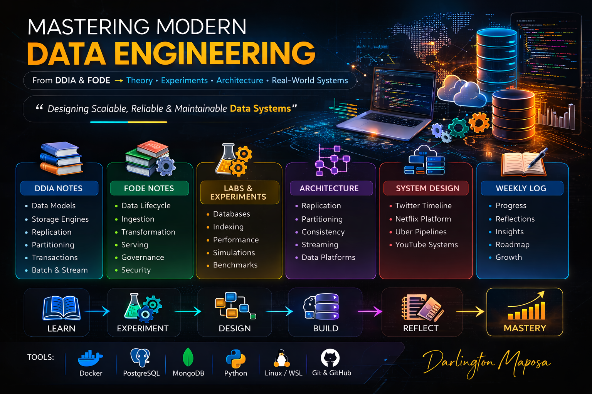

# Data Engineering Learning Repository

**Developing deep expertise in modern data engineering through distributed systems and practical experiments inspired by DDIA and FODE**

This repository documents my journey toward mastering modern data engineering and distributed data systems.

The goal of this project is to develop deep expertise in distributed data systems, data architecture, and large-scale data processing by studying foundational literature and implementing practical experiments based on their concepts.

Books being studied:

• *Designing Data-Intensive Applications* – Martin Kleppmann  
• *Fundamentals of Data Engineering* – Joe Reis & Matt Housley

---

# Table of Contents

- [Overview](#overview)
- [Repository Structure](#repository-structure)
- [What This Repository Contains](#what-this-repository-contains)
  - [DDIA Notes](#ddia-notes)
  - [FODE Notes](#fode-notes)
  - [Architecture Patterns](#architecture-patterns)
  - [Labs](#labs)
  - [System Design](#system-design)
  - [Datasets](#datasets)
  - [Experiments](#experiments)
  - [Weekly Learning Log](#weekly-learning-log)
- [Tools Used](#tools-used)
- [Purpose](#purpose)
- [Long-Term Goal](#long-term-goal)
- [Author](#author)

---

# Overview

This repository serves as a structured engineering notebook where I:

- Study core data engineering concepts
- Document insights from foundational literature
- Build practical experiments demonstrating system behavior
- Analyze architectures used in real-world data platforms
- Develop deep intuition about distributed data systems

The repository combines **theory, experimentation, and system design** to develop practical expertise in modern data engineering.

---

# Repository Structure
└── data-engineering-learning
    ├── README.md
    ├── datasets
    │   ├── README.md
    │   ├── real-world
    │   └── synthetic
    ├── experiments
    │   └── README.md
    ├── images
    │   ├── batch_vs_stream.png
    │   ├── data_platform_architecture.png
    │   ├── fanout_timeline.png
    │   ├── landing_image1.png
    │   ├── landing_image2.png
    │   ├── partitioning_diagram.png
    │   └── replication_diagram.png
    ├── labs
    │   ├── README.md
    │   ├── data-models-lab
    │   ├── fanout-timeline
    │   ├── indexing-benchmark
    │   └── replication-simulation
    ├── learning-roadmap
    │   └── study-plan.md
    ├── notes
    │   ├── architecture-patterns
    │   ├── ddia
    │   ├── distributed-systems
    │   └── fode
    ├── resources
    │   ├── articles.md
    │   ├── papers.md
    │   └── tools.md
    ├── system-design
    │   ├── netflix-data-platform
    │   ├── twitter-timeline
    │   ├── uber-data-pipeline
    │   └── youtube-recommendations
    └── weekly-learning-log
        ├── articles.md
        ├── papers.md
        ├── reflections.md
        ├── tools.md
        ├── week01.md
        ├── week02.md
        └── week03.md

---

# What This Repository Contains

## DDIA Notes

Detailed notes and explanations from *Designing Data-Intensive Applications* covering topics such as:

- Data models
- Storage engines
- Replication
- Partitioning
- Transactions
- Distributed systems challenges
- Batch and stream processing

---

## FODE Notes

Notes from *Fundamentals of Data Engineering* exploring:

- The data engineering lifecycle
- Data architecture
- Data ingestion
- Data transformation
- Data serving
- Governance and security

---

## Architecture Patterns

Deep explanations of important distributed data system concepts including:

- Replication strategies
- Data partitioning
- Consistency models
- Lambda vs Kappa architectures
- Streaming system architectures

---

## Labs

Hands-on experiments that implement and test important concepts such as:

- Relational vs document database modeling
- Indexing performance benchmarking
- Fan-out timeline architectures
- Replication behavior simulations

These labs help translate **theoretical concepts into practical understanding**.

---

## System Design

Architecture studies of large-scale data systems including:

- Twitter timeline architecture
- Netflix data platform
- Uber data pipelines
- YouTube recommendation systems

The goal is to understand how real companies design scalable data platforms.

---

## Datasets

Datasets used in experiments and simulations.

Includes:

- Synthetic datasets generated for experiments
- Real-world datasets used for benchmarking

---

## Experiments

Documentation of experiment results, performance analysis, and observations derived from the labs.

---

## Weekly Learning Log

A record of weekly learning progress including:

- Articles studied
- Research papers reviewed
- Tools explored
- Personal reflections and insights

---

# Tools Used

Experiments in this repository use modern data engineering tools including:

- Docker
- PostgreSQL
- MongoDB
- Python
- Linux / WSL
- Git & GitHub

---

# Purpose

This repository is not just a collection of notes.

It is intended to function as a **data engineering lab notebook** where theoretical knowledge is combined with practical experimentation and system design thinking.

---

# Long-Term Goal

To develop strong expertise in designing scalable, reliable, and maintainable data systems and to apply these principles in real-world data engineering projects.

---

# Author

**Darlington Maposa**

Data Engineer | Distributed Systems Enthusiast

