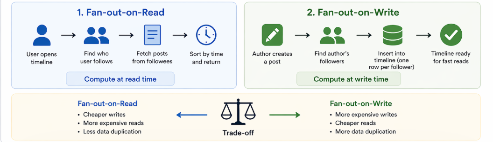
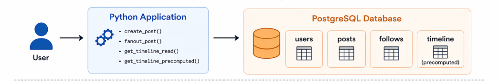

# Mini Twitter System

> A data engineering lab exploring timeline architectures and read/write tradeoffs in data systems.



---

## Overview

This project models a simplified social media system to understand how **data models and query patterns shape system behavior**.

The primary focus is the design of **user timelines (home feeds)** and how different architectures impact performance and complexity.

---

## Core Idea

> The way you structure data determines how your system behaves.

This project explores two approaches:

- **Fan-out-on-read** → compute timeline when requested  
- **Fan-out-on-write** → precompute timeline when data is written  

---

## Architecture



---

## Data Model

| Table      | Description                              |
|------------|------------------------------------------|
| `users`    | User identities                          |
| `posts`    | User-generated content                   |
| `follows`  | Social graph (who follows who)           |
| `timeline` | Precomputed feed entries (derived state) |

---

## Timeline Strategies

### Fan-out-on-read

- Timeline computed at query time  
- Fetch posts based on follow relationships  
- **Cheap writes, expensive reads**  
- No data duplication  

---

### Fan-out-on-write

- Timeline entries created on post creation  
- Each follower receives a feed entry  
- **Expensive writes, cheap reads**  
- Introduces **derived state**

---

## Tradeoff

| Strategy            | Write Cost | Read Cost | Complexity |
|--------------------|-----------|----------|-----------|
| Fan-out-on-read     | Low       | High     | Low       |
| Fan-out-on-write    | High      | Low      | Higher    |

> There is no universally correct approach — it depends on workload characteristics.

---

## Design Decisions

### Relational Data Model (PostgreSQL)
- Chosen for strong consistency and relational modeling
- Enables expressive SQL queries

**Tradeoff:** joins can become expensive at scale  

---

### Separate `follows` Table
- Models many-to-many relationships cleanly

**Tradeoff:** requires joins for relationship resolution  

---

### Start with Fan-out-on-read
- Simpler baseline
- No duplication

**Tradeoff:** expensive reads  

---

### Introduce Fan-out-on-write (`timeline`)
- Improves read performance
- Stores derived state

**Tradeoff:** increased write cost and complexity  

---

### Store References, Not Full Data
- `timeline` stores `post_id` only

**Tradeoff:** requires joins when reading  

---

### Enforce Uniqueness
- Prevent duplicate timeline entries

**Tradeoff:** adds constraint overhead  

---

### Synchronous Fan-out
- Simple and easy to debug

**Tradeoff:** write latency increases  

---

### No Background Processing
- Keeps system simple for learning

**Tradeoff:** not scalable  

---

### Raw SQL over ORM
- Full control and visibility

**Tradeoff:** more verbose  

---

### Manual Schema Management
- Clear understanding of schema evolution

**Tradeoff:** not production scalable  

---

## Experiment Results

This section compares observed behavior between fan-out-on-read and fan-out-on-write using the same dataset.

---

### Test Setup

- Users: 3–5  
- Posts: multiple per user  
- Follow relationships established  
- Timeline retrieved multiple times  

---

### Fan-out-on-read

**Write Path**
- 1 insert into `posts`

**Read Path**
- 1 query with:
  - subquery on `follows`
  - join with `posts`
  - sorting (`ORDER BY created_at DESC`)

**Observations**
- Simple write logic  
- Query becomes more complex as data grows  
- Read latency increases with:
  - number of posts
  - number of follow relationships  

---

### Fan-out-on-write

**Write Path**
- 1 insert into `posts`
- N inserts into `timeline` (N = number of followers)

**Read Path**
- Simple query:
  - fetch from `timeline`
  - join with `posts`

**Observations**
- Write cost increases significantly  
- Read queries are much simpler and faster  
- Timeline is immediately available without computation  

---

### Comparative Summary

| Aspect        | Fan-out-on-read | Fan-out-on-write |
|--------------|----------------|------------------|
| Write Cost    | Low            | High             |
| Read Cost     | High           | Low              |
| Query Complexity | High       | Low              |
| Data Duplication | None       | Partial (timeline entries) |
| Scalability   | Read-limited   | Write-limited    |

---

### Key Insight

> Work can be shifted between read-time and write-time, but it cannot be eliminated.

---

## Repository Structure
```
mini-twitter-system/
│
├── README.md
├── requirements.txt
├── experiment_notes.md
│
├── sql/
│ ├── schema.sql
│ └── seed.sql
│
├── app/
│ ├── db.py
│ ├── main.py
│ └── services/
│ ├── users.py
│ ├── posts.py
│ ├── follows.py
│ └── timeline.py
```


### Structure Overview

- **`sql/`**  
  Contains database definitions and seed data  
  - `schema.sql` → database schema (tables, constraints)  
  - `seed.sql` → sample data for testing  

- **`app/`**  
  Application logic for interacting with the database  
  - `db.py` → database connection management  
  - `main.py` → entry point for running the system  
  - `services/` → domain logic (users, posts, follows, timeline)  

- **`experiment_notes.md`**  
  Observations and findings from comparing timeline strategies  

- **`requirements.txt`**  
  Python dependencies  

---

## Setup

### 1. Start PostgreSQL

Ensure PostgreSQL is running and accessible.

### 2. Apply schema

```bash
psql -U postgres -h <host-ip> -p 5432 -d mini_twitter -f sql/schema.sql


## Running the Project
Execute the main script:
This runs test flows such as:

- user creation
- post creation
- follow relationships
- timeline retrieval

## Observability
Inspect database state directly:
`psql -U postgres -h <host-ip> -p 5432 -d mini_twitter`

## Failure Modes
Introducing fan-out-on-write adds complexity:

- Partial fan-out (some followers receive entries, others don’t)
- Duplicate entries (guarded by constraints)
- Timeline inconsistency with source data
- Increased write amplification

This highlights a key principle:

*Derived data must be carefully maintained.*

## Key Learnings
- Data models define system capabilities
- Queries define application behavior
- Performance is a consequence of design choices
- Precomputation trades storage and write cost for read efficiency
- Systems become more complex as optimization increases


## Future Improvements
- Pagination for timelines
- Indexing strategies for performance
- Handling high-follower users (celebrity problem)
- Background jobs for asynchronous fan-out
-Event-driven architecture (Kafka-style)

## References
- Designing Data-Intensive Applications (DDIA)
- Real-world social feed architectures (Twitter, Facebook)

## Author
Darlington Maposa
Data Engineering Lab Series
